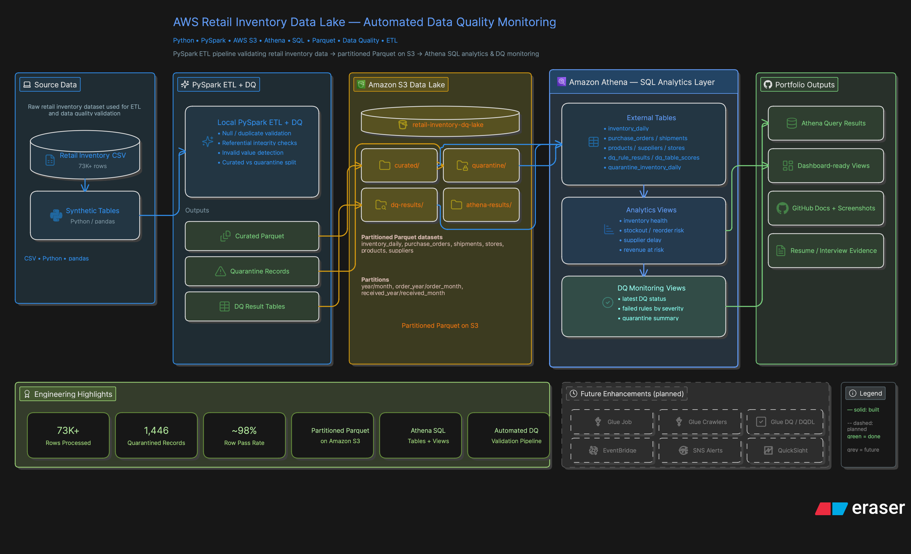

# AWS Retail Inventory Data Lake with Automated Data Quality Monitoring

Implementation-ready MVP portfolio project for early-career Data Engineering and Data Quality roles.

## Current implementation status

| Component | Status |
| --- | --- |
| Local synthetic data generation | Complete |
| Local PySpark ETL | Complete |
| S3 data lake upload | Complete |
| Athena external tables | Complete |
| Athena analytics views | Complete |
| Athena DQ views | Complete |
| Quarantine handling | Complete |
| Architecture diagram | Complete |
| QuickSight dashboard | Complete |
| AWS Glue job deployment | Future improvement |
| Glue Crawlers | Future improvement |
| Glue Data Quality / DQDL | Future improvement |
| EventBridge scheduling | Future improvement |
| SNS alerts | Future improvement |

## Project Summary

This project delivers a portfolio-ready retail inventory data platform: local PySpark ETL writes curated and quarantine data, S3 stores lake zones, Athena serves analytics and DQ monitoring views, and Amazon QuickSight provides executive-facing dashboards. The current implementation is practical and auditable; Glue job orchestration and native Glue DQ execution remain planned improvements.

## Architecture Diagram

This architecture shows the implemented MVP flow: local PySpark ETL with data quality checks, curated/quarantine/DQ outputs stored in Amazon S3, Athena external tables/views for analytics and data quality reporting, and Amazon QuickSight dashboards for business consumption. AWS Glue, Glue Data Quality, EventBridge, and SNS are shown as future enhancements, not current implementation.

## Business Problem

Retail teams need trustworthy inventory and replenishment insights. Poor data quality causes bad stock decisions, missed sales, and weak reporting confidence.

## Data Engineering Problem

Design a reliable, rerunnable raw-to-curated pipeline with explicit data quality controls, partitioned storage, and low query cost.

## Architecture (High Level)

- Raw CSVs land in `s3://retail-inventory-dq-lake/raw/`
- Local PySpark ETL transforms + validates records
- PySpark handles cross-column and cross-table checks
- Passed records go to curated Parquet (partitioned)
- Failed records go to quarantine with failure reason
- DQ run summaries are written to DQ monitoring tables
- Athena external tables and views power reporting
- Amazon QuickSight dashboards consume Athena-backed datasets for inventory and DQ insights

Detailed architecture notes: `docs/architecture.md`

## Amazon QuickSight Dashboard

The published Amazon QuickSight dashboard completes the **AWS-native consumption layer** for this project. It is built from **Athena-backed datasets** over `retail_curated_db` and `retail_dq_db`, using tables and views already validated in Athena (`sql/analytics_views.sql`, `sql/dq_views.sql`). ETL still runs locally with PySpark; S3, Athena, and QuickSight are the implemented AWS surfaces.

The dashboard contains two sheets:

### 1. Retail Inventory Intelligence

- Total stockout records
- Average supplier delay
- Products requiring replenishment
- Average stockout rate
- Stockout rate by store and category
- Supplier delay rate
- Replenishment priority table

### 2. Data Quality Control Centre

- Row pass rate
- Curated rows
- Quarantined rows
- Total input rows
- Failed rows by DQ severity
- Rule-level DQ status
- Quarantined records by failure type
- DQ rules checked

Proof screenshots: `docs/screenshots/12_quicksight_inventory_dashboard.png`, `docs/screenshots/13_quicksight_dq_dashboard.png`.  
Full dashboard notes: `docs/quicksight_dashboard.md`.

## Dataset Strategy

- Source-of-truth fact table: `inventory_daily` (Retail Store Inventory Forecasting dataset)
- Supporting tables (stores/products/suppliers/purchase_orders/shipments) generated from canonical keys in `inventory_daily`
- Synthetic data is explicitly documented as synthetic

## S3 Folder Structure

See `docs/architecture.md` and `docs/data_model.md` for final mapping.

## Data Model Summary

See `docs/data_model.md`.

## Data Quality Strategy

Current implementation uses PySpark + Athena SQL checks and quarantine monitoring.  
See `docs/dq_rules.md` for the full rule split and Glue DQ roadmap.

## Local Run (Planned)

1. Generate supporting synthetic tables.
2. Run ETL locally with PySpark-compatible mode.
3. Validate outputs in local folders before AWS upload.

Detailed commands will be added in later phases.

## AWS Run (Planned)

1. Upload raw files to S3.
2. Run raw crawler.
3. Run Glue ETL job with parameters.
4. Register partitions (`MSCK REPAIR TABLE` or crawler).
5. Execute Athena view SQL.

## Athena Views

- Business views: `sql/analytics_views.sql`
- DQ views: `sql/dq_views.sql`

## Screenshots / Proof of Implementation

The screenshots in `docs/screenshots/` show concrete proof that the MVP is implemented and queryable end-to-end.

- `01_s3_bucket_structure.png` - S3 zone structure is in place.
- `02_s3_curated_partitions.png` - Curated fact data is partitioned.
- `03_athena_databases_tables.png` - Athena external tables are registered.
- `04_inventory_count_query.png` - Curated data is queryable in Athena.
- `05_partition_registration.png` - Partition discovery (`MSCK REPAIR TABLE`) works.
- `06_inventory_health_view.png` - Inventory analytics view is working.
- `07_stockout_rate_view.png` - Stockout KPI view is working.
- `08_supplier_delay_view.png` - Supplier delay analytics join is working.
- `09_dq_latest_status_view.png` - DQ rule-status monitoring is queryable.
- `10_dq_quarantine_summary_view.png` - Quarantine failure summary is queryable.
- `11_dq_row_level_quality_summary.png` - Row-level DQ pass-rate metrics are queryable.
- `12_quicksight_inventory_dashboard.png` - QuickSight Retail Inventory Intelligence sheet is published.
- `13_quicksight_dq_dashboard.png` - QuickSight Data Quality Control Centre sheet is published.

Implementation status reflected by these screenshots:
- **Implemented:** local PySpark ETL, Amazon S3 data lake, Athena external tables/views, quarantine handling, Amazon QuickSight dashboards (Athena-backed).
- **Future improvements:** AWS Glue job deployment, Glue Crawlers, AWS Glue Data Quality / DQDL, EventBridge scheduling, SNS alerts.

## Cost Control Notes

See `docs/cost_notes.md`.

## Cleanup Checklist

To be finalized in Phase 6 (delete jobs, crawlers, test data, BI resources).

## Resume Bullets

To be finalized in Phase 6.

## Interview Pitch

To be finalized in Phase 6.

## Portfolio Value

- Demonstrates end-to-end data lake design from raw data through SQL analytics to QuickSight dashboards.
- Shows practical data quality engineering through validation, quarantine handling, and DQ monitoring views.
- Uses partitioned Parquet on S3 and Athena external tables/views for scalable analytics patterns.
- Documents current implementation honestly while outlining realistic AWS Glue orchestration and alerting enhancements.

## Limitations and Future Improvements

MVP first; streaming, IaC, and ML are out of scope for initial build.

## Definition of Done

- [ ] Raw CSV data is stored in S3.
- [ ] Raw data is cataloged by Glue Crawler.
- [ ] ETL job runs successfully from raw to curated.
- [ ] Curated fact data is written as partitioned Parquet.
- [ ] `inventory_daily` includes `event_date` in the schema.
- [ ] Reruns use partition-scoped overwrite.
- [ ] At least 10 DQ rules are implemented.
- [ ] Failed records are written to quarantine with failure reasons.
- [ ] DQ results are queryable in Athena.
- [ ] At least 5 business Athena views exist.
- [ ] At least 3 DQ Athena views exist.
- [x] Dashboard has Inventory Intelligence and DQ Control Centre pages.
- [ ] README includes architecture, run steps, data model, DQ rules, costs and teardown.
- [ ] No secrets, credentials or unredacted AWS account IDs are committed.
- [ ] Screenshots redact account IDs and sensitive identifiers.
