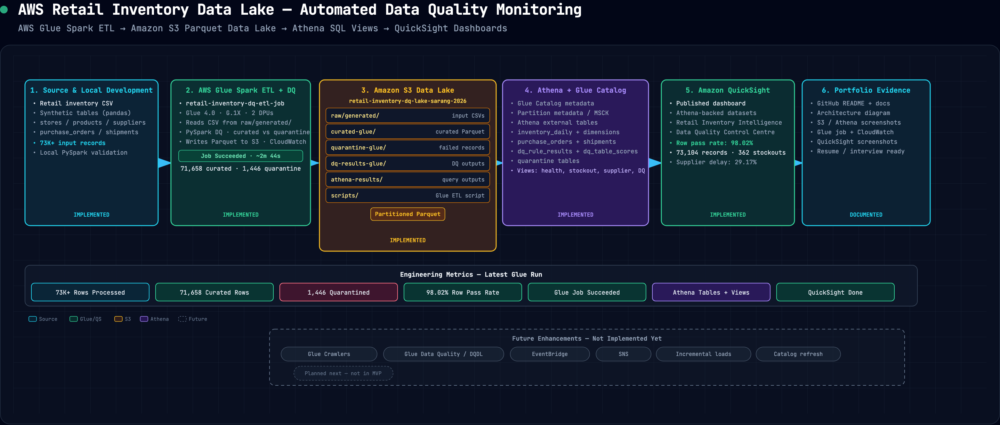

# Architecture

Interactive diagram: [`architecture_diagram.html`](architecture_diagram.html)

## Overview

This project implements a retail inventory data lake with automated data quality monitoring. The MVP supports two ETL execution modes on the **same PySpark script** (`scripts/glue_etl_inventory_dq.py`):

- **Local PySpark** — development and testing against local folders
- **AWS Glue Spark ETL** — cloud execution writing to dedicated `-glue` S3 prefixes

Downstream layers are **Amazon S3**, **Athena** (external tables and views), and **Amazon QuickSight**. Glue Crawlers, native Glue Data Quality (DQDL), EventBridge, and SNS remain future enhancements.

The end-to-end diagram is at `docs/screenshots/architecture_diagram.png` (source: `docs/architecture_diagram.html`). Re-export with `python3 scripts/export_architecture_diagram.py`. Glue operations are documented in `docs/glue_job_runbook.md`.

## Implemented MVP flow

1. Synthetic source CSVs are generated locally with `scripts/generate_synthetic_tables.py`.
2. CSVs are uploaded to `s3://retail-inventory-dq-lake-sarang-2026/raw/generated/` (and/or kept under local `data/generated/` for dev).
3. **Local PySpark ETL** runs for fast validation; outputs land under local `data/curated`, `data/quarantine`, `data/dq-results`.
4. **AWS Glue Spark ETL** runs the same script in the cloud (IAM role `AWSGlueServiceRoleRetailInventoryDQ`); outputs land under `curated-glue/`, `quarantine-glue/`, `dq-results-glue/`.
5. Curated records are partitioned Parquet; failed records include `failure_reason`; DQ summaries go to `dq-results/` or `dq-results-glue/`.
6. Athena external tables are registered over S3 using `sql/create_external_tables.sql` (MVP proof uses `curated/` paths; Glue paths can be registered separately).
7. Curated partitions are made queryable using `MSCK REPAIR TABLE` (manual step today, not a Glue Crawler).
8. Athena business and DQ views are created from `sql/analytics_views.sql` and `sql/dq_views.sql`.
9. Amazon QuickSight dashboards consume Athena-backed datasets.
10. Implementation proof is in `docs/screenshots/` (`01`–`19`).

## Architecture components

- **Source data**: Synthetic retail inventory CSVs (`inventory_daily`, `products`, `stores`, `suppliers`, `purchase_orders`, `shipments`).
- **PySpark ETL + DQ (local)**: Same script, run on a developer machine for iteration and tests.
- **AWS Glue Spark ETL (cloud)**: Same script, managed Spark cluster, CloudWatch logging, S3 read/write on `-glue` zones.
- **Amazon S3 data lake**: Raw, curated, curated-glue, quarantine, quarantine-glue, DQ results, Athena query staging.
- **Athena SQL analytics layer**: External tables and curated business + DQ views.
- **Amazon QuickSight**: Published dashboards on Athena-backed datasets.
- **Portfolio outputs**: README, architecture docs, Glue runbook, screenshots, SQL, DQDL reference rules.
- **Future enhancements**: Glue Crawlers, AWS Glue Data Quality (DQDL), Amazon EventBridge, Amazon SNS.

## Data quality flow

1. Source data is read into PySpark (local or Glue).
2. Single-column and cross-table checks run inline.
3. Passed records → `curated/` or `curated-glue/`.
4. Failed records → `quarantine/` or `quarantine-glue/` with `failure_reason`.
5. DQ summaries → `dq-results/` or `dq-results-glue/`, exposed via Athena DQ views.
6. QuickSight visualizes inventory and DQ metrics (screenshots `12`–`13`).
7. Glue execution proof: job succeeded, arguments, CloudWatch, S3 outputs (screenshots `14`–`19`).
8. Reference DQDL in `dq_rules/` targets a future native Glue Data Quality run.

## S3 data lake zones

| Zone | Path | Purpose |
| --- | --- | --- |
| Raw / generated | `s3://retail-inventory-dq-lake-sarang-2026/raw/generated/` | Source CSVs for Glue (and upload staging) |
| Curated (MVP / local path) | `s3://retail-inventory-dq-lake-sarang-2026/curated/` | Validated Parquet (local ETL upload / Athena MVP) |
| Curated (Glue) | `s3://retail-inventory-dq-lake-sarang-2026/curated-glue/` | Glue Spark ETL curated outputs |
| Quarantine (MVP) | `s3://retail-inventory-dq-lake-sarang-2026/quarantine/` | Failed records (local path) |
| Quarantine (Glue) | `s3://retail-inventory-dq-lake-sarang-2026/quarantine-glue/` | Failed records (Glue path) |
| DQ results (MVP) | `s3://retail-inventory-dq-lake-sarang-2026/dq-results/` | DQ outputs (local path) |
| DQ results (Glue) | `s3://retail-inventory-dq-lake-sarang-2026/dq-results-glue/` | DQ outputs (Glue path) |
| Athena results | `s3://retail-inventory-dq-lake-sarang-2026/athena-results/` | Athena query output staging |

## Athena SQL layer

- **External tables** (`sql/create_external_tables.sql`): register curated, quarantine, and DQ result data over S3.
- **Business views** (`sql/analytics_views.sql`): e.g. `vw_inventory_health`, `vw_stockout_rate_by_store`, `vw_supplier_delay_rate`
- **DQ monitoring views** (`sql/dq_views.sql`): e.g. `vw_latest_dq_status`, `vw_quarantine_summary`, `vw_row_level_quality_summary`

## AWS Glue Spark ETL layer

| Item | Detail |
| --- | --- |
| Script | `scripts/glue_etl_inventory_dq.py` |
| IAM role | `AWSGlueServiceRoleRetailInventoryDQ` |
| Input | `s3://retail-inventory-dq-lake-sarang-2026/raw/generated/` |
| Outputs | `curated-glue/`, `quarantine-glue/`, `dq-results-glue/` |
| Job parameters | Underscore keys (`--input_base_path`, etc.) — see `docs/glue_job_runbook.md` |
| Proof | Screenshots `14`–`19` |

## Amazon QuickSight layer

Published dashboards use Athena-backed datasets over `retail_curated_db` and `retail_dq_db`. See `docs/quicksight_dashboard.md` and screenshots `12`–`13`.

## Portfolio outputs

- `README.md` — project overview and status
- `docs/architecture.md` — this document
- `docs/glue_job_runbook.md` — Glue deployment and troubleshooting
- `docs/quicksight_dashboard.md` — BI layer
- `docs/screenshots/01`–`19` — S3, Athena, QuickSight, and Glue proof
- `sql/` and `dq_rules/` — reference SQL and DQDL

## Future enhancements

- **Glue Crawlers** — automatic schema and partition registration
- **AWS Glue Data Quality (DQDL)** — native rule execution from `dq_rules/`
- **Amazon EventBridge** — scheduled / event-driven triggers
- **Amazon SNS** — DQ and quarantine alerting

## What is not implemented yet

- Glue Crawlers (partitions registered manually via `MSCK REPAIR TABLE` today)
- AWS Glue Data Quality (DQDL) execution (`dq_rules/*.dqdl` are reference only; checks run in PySpark)
- Amazon EventBridge scheduling
- Amazon SNS alerting
- Athena tables registered directly over `curated-glue/` (optional follow-up; MVP Athena proof uses `curated/`)

## Diagram explanation

| Diagram section | What it does | Current status |
| --- | --- | --- |
| Source Data | Synthetic retail CSVs | Implemented |
| PySpark ETL + DQ (local) | Dev/test runs on local paths | Implemented |
| AWS Glue Spark ETL | Cloud execution to `-glue` S3 zones | Implemented |
| Amazon S3 Data Lake | Raw, curated, quarantine, DQ, Glue variants | Implemented |
| Athena SQL Analytics Layer | External tables and views | Implemented |
| Amazon QuickSight | Athena-backed dashboards | Implemented |
| Portfolio Outputs | Docs, screenshots, SQL, DQDL | Implemented |
| Future Enhancements | Glue Crawlers, Glue DQ, EventBridge, SNS | Planned |
